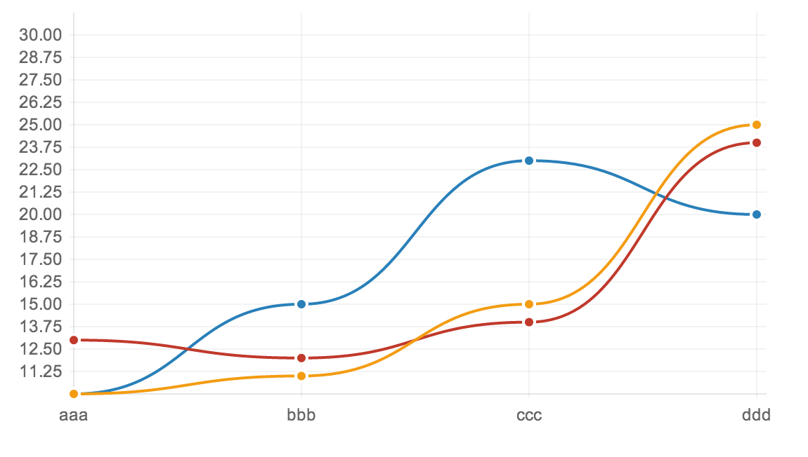
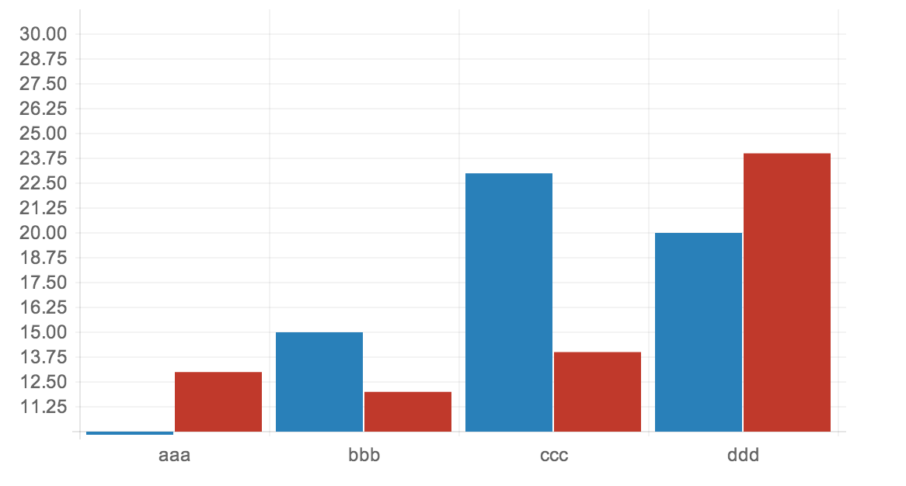
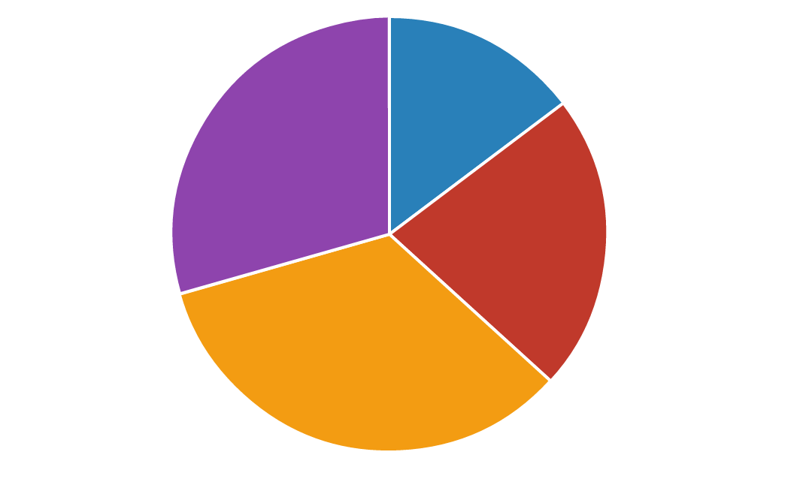

goplot
======

goplot是一个使用简单的绘制图表的工具，图表绘制使用了[Chart.js](http://www.chartjs.org/)开源库，编译好的goplot只有一个二进制文件，不依赖任何库/网络。

##### 下 载
[Mac OS X](http://www.bigendian123.com/goplot-darwin.tar.gz)

[Linux amd64](http://www.bigendian123.com/goplot-linux-amd64.tar.gz)

Windows暂缺

##### 使用方法
* 解压下载包后，进入解压目录，可以看到一个goplot的可执行文件和一些*.chart文件，这些chart文件是默认的一些数据文件样例。可以在这些chart文件的目录执行goplot，然后通过浏览器访问http://localhost:8000就可以看到图表了。
* 你可以把`goplot`工具放到你的`PATH`中，在chart文件所在的目录执行goplot即可。
* chart文件必须是.chart后缀名，内容可以参考源码examples目录中的例子。启动goplot的目录如果有多个chart文件，可以通过不断刷新网页来切换图表。

##### 曲线图

##### 柱状图

##### 饼图
